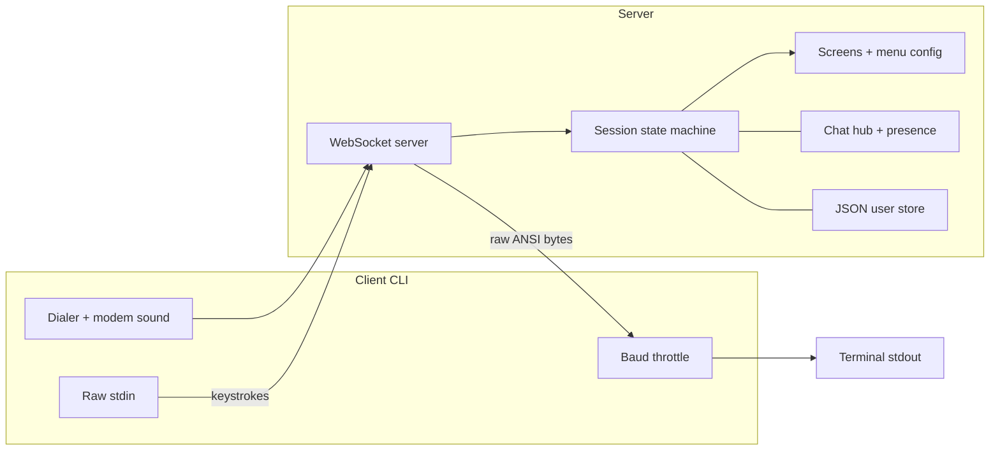
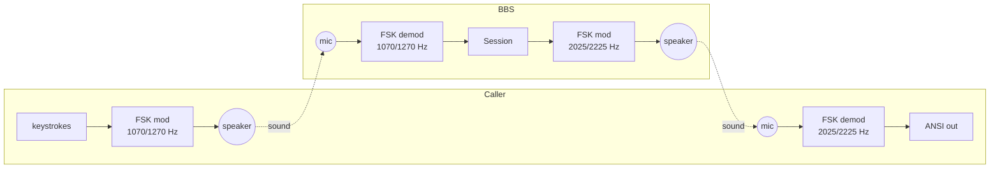

# nodebbs

Dial into an ANSI BBS from your terminal, like it's 1994.


> The browser client (`web/`) dialing into the BBS at 9600 baud: modem handshake, color-cycling ANSI welcome, signup, main menu, Who's Online, a round of Hi-Lo, and the `NO CARRIER` power-off — wrapped in a CRT monitor with scanlines and phosphor glow.

`nodebbs` is a retro bulletin board system in three parts:

- **server/** holds all the session logic and streams raw **ANSI/VT100 bytes** to callers over a WebSocket.
- **client/** is a thin CLI "modem": it synthesizes a **baud-dependent dial-up handshake** (dial tone, DTMF, ringback, carrier negotiation), throttles the incoming bytes to a **simulated baud rate**, and forwards your keystrokes back to the server.
- **web/** is a Next.js browser client (deployable to Vercel) that renders the same stream in an `xterm.js` terminal wrapped in a **CRT monitor** — scanlines, phosphor glow, curvature, flicker, plus synthesized tube hum, degauss thunk, and the same per-baud modem handshake.

Because the server just streams bytes and each client just prints them, colored ASCII, cursor animations, live presence counts, and multi-user chat all work with no special client support.

There's also an opt-in [**acoustic mode**](#acoustic-mode-no-internet): the CLI and web clients can dial the BBS *over sound* — a real Bell 103 software modem where the speaker talks to the microphone — with no network at all.



## Quick start

Requires Node.js 18+.

```bash
# 1. install both packages
npm run install:all

# 2. start the BBS server (terminal 1)
npm run server

# 3. dial in from a client (terminal 2, or a friend's machine)
npm run call
```

`npm run call` dials `ws://localhost:3000` at a simulated 2400 baud. To connect elsewhere or change speed, run the client directly:

```bash
node client/index.js ws://some-host:3000 --baud 9600
node client/index.js localhost:3000 --no-sound   # skip dial-up sound + handshake delay
node client/index.js --baud 0                     # full speed (no throttle)
```

While connected, press **Ctrl+]** (or Ctrl+C) to hang up. You'll get a satisfying `NO CARRIER`.

The dial-up sound isn't a recording — it's synthesized per baud, modeled on the real standards, and the `CONNECT` banner lands when the handshake finishes. 300 baud (Bell 103) is short and pure; 1200/2400 add scramble and training warbles; 9600 (V.32) adds echo-canceller probing; 14400 (V.32bis) throws in the iconic fast dual-tone trill everyone remembers; `--baud 0` gets the full V.34-style drama with the long training hiss.

### First call

1. The animated logo plays — press any key.
2. At `LOGIN:` type an existing handle, or type `NEW` to register (handle + password).
3. You land in the Main Menu. Press the letter in `[brackets]` to pick an option:
   `[C]` chat, `[G]` games, `[W]` who's online, `[X]` log off.

Open a second client and log in as a different user to try multi-user chat and watch the "callers online" count change.

## Web client (browser + CRT)

The [web/](web) app is a Next.js (App Router) client that connects to the same WebSocket server and renders the ANSI stream inside a simulated CRT monitor. It keeps the terminal locked to a true **80 columns** (scaling the font to fit) so the server's ANSI art always lines up.

Run it locally alongside the server:

```bash
cd web
npm install
npm run dev            # http://localhost:3001
```

Then open the page, set the **SERVER** field (defaults to `ws://localhost:3000`), pick a baud rate + modem sound, and hit **DIAL**. Use the **HANG UP** button to disconnect.

### Deploy to Vercel

The web client is a standard Next.js app and deploys to Vercel with no extra config:

1. Point Vercel at the repo and set the **Root Directory** to `web/`.
2. Add an environment variable so the dialer defaults to your public server instead of localhost:

   ```
   NEXT_PUBLIC_BBS_URL=wss://your-bbs-host.example.com
   ```

   Use `wss://` (TLS) — browsers block insecure `ws://` from an `https://` page. Callers can still override the target in the SERVER field at runtime.
3. Deploy. The BBS server itself is a long-lived WebSocket process, so host it somewhere that keeps a socket open (a small VM, Fly.io, Railway, a container, etc.) — not on Vercel's serverless functions.

## Acoustic mode (no internet)

You can also dial the BBS **over sound** — the client's speaker sings to the server's microphone and back, like a 1960s acoustic coupler. It's a real software modem: full-duplex binary **FSK** with frequency-division duplexing, the same scheme as a Bell 103. This is an **additional, opt-in line**, never a replacement — the WebSocket server keeps running exactly as before, and acoustic callers land in the same `Session` layer (they show up in Who's Online and chat like everyone else).



Each side transmits in its own frequency band and only demodulates the *other* band, so your own carrier leaking back into your mic is simply filtered out. On top of the raw byte pipe sits an optional **MNP/V.42-style reliable link** (CRC-16 framing, window-2 ARQ) that keeps the session byte-clean over a noisy room; `--robust` adds Hamming FEC + interleaving for genuinely bad conditions.

**Prerequisite:** the [`sox`](http://sox.sourceforge.net/) toolkit provides the `rec`/`play` audio I/O.

```bash
brew install sox          # macOS
sudo apt-get install sox  # Debian/Ubuntu
```

Then open the acoustic line on the server and dial it from the client:

```bash
node server/src/index.js --audio          # WebSocket AND the acoustic line
node client/index.js --audio               # dial over sound instead of ws://
node client/index.js --audio --robust      # add FEC for a noisy room
```

Before dialing, run the line test — it's the acoustic equivalent of listening to the line first. It plays each tone and measures how strongly it returns at the mic, then gives plain advice:

```bash
node scripts/line-test.js
```

**In the browser**, the web dialer has a **LINE** selector: leave it on `INTERNET` for the normal WebSocket flow, or pick `PHONE LINE` to place a real acoustic call from the browser (it asks for mic permission, then modulates through your speaker via an `AudioWorklet`). Append `?loopback=1` to the URL to unlock a `LOOPBACK` line — an in-process DSP self-test that wires a full originate+answer modem pair through a virtual "air" so you can watch the whole handshake and ARQ work without a second machine or any hardware.

**What to expect:** the link runs at **300 baud — about 30 characters per second**. The animated welcome screen takes roughly a minute to paint. That slowness *is* the point; it's what dialing a BBS actually felt like. Tips for a clean connection:

- Volume around **70%**; devices about **30 cm** apart, speaker facing mic.
- Keep the room reasonably quiet (fans, music, and heavy typing are the enemy). If it's flaky, add `--robust`.
- Same-machine demo: run `--audio` server and `--audio` client on one computer — the two bands don't overlap, so each side only decodes the other. Log in, browse a menu, hang up, and the server returns to idle listening for the next caller.

Under the hood the whole stack is verifiable headlessly, no hardware needed:

```bash
node scripts/fsk-loopback.js   # modem survives reverb + noise (room simulator)
node scripts/arq-loopback.js   # reliable link stays byte-clean over a lossy channel
node scripts/audio-e2e.js      # full dial → answer → ARQ session over a virtual air
```

## Configuration

Edit [server/nodebbs.json](server/nodebbs.json):

```json
{
  "name": "The Demo BBS",
  "sysop": "Pablo",
  "description": "A NodeJS ANSI BBS you dial into from your terminal",
  "port": 3000,
  "startScreen": "Welcome"
}
```

`name`, `sysop`, and `description` show up on the banners/menus; `startScreen` is the screen every caller lands on first. `port` can be overridden with the `PORT` environment variable (e.g. `PORT=8080 npm run server`). Connection speed isn't set here — each caller picks their own simulated baud in the client (the CLI's `--baud` flag or the web dialer).

User accounts are stored (with scrypt-hashed passwords) in `server/data/users.json`, created automatically on first signup.

## How it's organized

```
shared/                 (acoustic modem DSP + link layer, shared by CLI + server)
  fsk.js            Bell 103 FSK modulator/demodulator, carrier + tone detect
  arq.js            MNP/V.42-style reliable link: CRC framing, ARQ, Hamming FEC
  audio-io.js       sox rec/play raw-PCM streams (with a friendly missing-sox error)

server/src/
  index.js          WebSocket server; one Session per caller; --audio opens the acoustic line
  session.js        Per-caller state machine: output, key input, navigation
  menu.config.js    Declarative menus (pure data)
  art/index.js      ANSI block-font banners + animated welcome
  lib/
    ansi.js         Colors, cursor moves, boxes, centering
    ansimate.js     Frame animation + typewriter (cancellable on keypress)
    keys.js         Decodes raw bytes into key tokens (arrows, enter, etc.)
    screen.js       defineScreen(): turns { art, enter, key, leave } into a screen
    users.js        JSON user store, scrypt password hashing
    chat.js         Global chat room: join/leave/broadcast + history
    presence.js     Live session registry (online counts, who's online)
  transports/
    audio.js        Answer-side acoustic modem: listen → answer → ws-shim into Session
  screens/
    welcome.js login.js menu.js chat.js whosonline.js goodbye.js
    games/hilo.js games/tictactoe.js

client/
  index.js          Dialer: handshake audio, CONNECT banner, raw stdin bridge (--audio path)
  lib/throttle.js   Baud-rate byte drainer (baud / 10 bytes per second)
  lib/modem.js      Per-baud handshake synthesizer + WAV encoder
  lib/audio-modem.js Originate-side acoustic modem: dial → calling tone → carrier → ARQ

web/
  app/page.js               Dialer UI (LINE: internet/phone/loopback, baud, sound) + connected view
  app/layout.js globals.css Fonts, base theme, dialer/status-bar styling
  components/CrtTerminal.js xterm bridge: transport abstraction, baud throttle, 80-col lock
  components/crt.css        CRT overlays: scanlines, glow, curvature, flicker
  lib/transport.js          WebSocket / acoustic / loopback transports (common interface)
  lib/fsk.js lib/arq.js     ESM mirrors of shared/fsk.js + shared/arq.js (browser DSP)
  lib/throttle.js           Browser baud throttle (Uint8Array)
  lib/sfx.js                Web Audio: CRT hum, degauss thunk, handshake playback
  lib/modem.js              Per-baud handshake synthesizer (mirror of client's)
  public/fsk-worklet.js     AudioWorklet hosting the modem DSP on the audio thread

scripts/                (headless verification — no hardware needed)
  fsk-loopback.js   FSK modem through a room simulator (reverb, noise, clacks)
  arq-loopback.js   reliable-link byte-integrity over a lossy channel
  audio-e2e.js      full dial→answer→ARQ session over a virtual air
  line-test.js      per-band SNR diagnostic for a real speaker/mic setup
```

## Adding a menu item

Menus are just data in [server/menu.config.js](server/menu.config.js). Add an entry to any menu's `items`:

```js
{ key: 'N', label: 'My New Thing', screen: 'MyScreen' }   // go to a screen
{ key: 'G', label: 'Game Room',    menu: 'games' }         // open another menu
{ key: 'X', label: 'Log Off',      action: 'logoff' }      // built-in action
```

Add a whole new sub-menu by adding a new keyed object and pointing to it with `menu: 'yourId'`.

## Adding a screen

A screen is a small module built with `defineScreen`. `enter` renders; `key` handles one keystroke at a time; `leave` cleans up. Navigate with `session.goto('Name', data)`.

```js
// server/src/screens/myscreen.js
const { defineScreen } = require('../lib/screen');
const ansi = require('../lib/ansi');

module.exports = defineScreen({
  activity: 'My Screen',                 // shown in Who's Online
  async enter(session) {
    session.write(ansi.clear + ansi.color('Hello, ' + session.user.handle + '!\r\n', 'brightCyan'));
    session.write('Press Q to go back.\r\n');
  },
  async key(session, key) {
    if ((key.ch || '').toLowerCase() === 'q') session.goto('Menu', { id: 'main' });
  },
});
```

Register it in [server/src/screens/index.js](server/src/screens/index.js):

```js
MyScreen: require('./myscreen'),
```

Then point a menu item at it with `screen: 'MyScreen'`.

Useful `session` helpers inside a screen:

- `session.write(str)` / `session.writeln(str)` — send ANSI to the caller
- `await session.readLine({ label, mask, max })` — classic line input (mask for passwords)
- `await session.readKey()` — one keystroke (throws when the caller navigates away)
- `session.cols` / `session.rows` — the caller's terminal size
- `session.user` — the logged-in user, or `null`
- `session.goto(name, data)` — navigate to another screen

## Tips for great ANSI

- Use `require('../lib/ansi')` helpers: `ansi.color(text, 'brightCyan')`, `ansi.moveTo(row, col)`, `ansi.center(text, width)`, `ansi.box(lines)`.
- For animation, `require('../lib/ansimate')` gives `playFrames(session, frames, { fps })` and `typewriter(session, text)`, both cancellable when the caller presses a key.
- Test at a real baud rate (`--baud 1200`) — it changes how animations feel.
